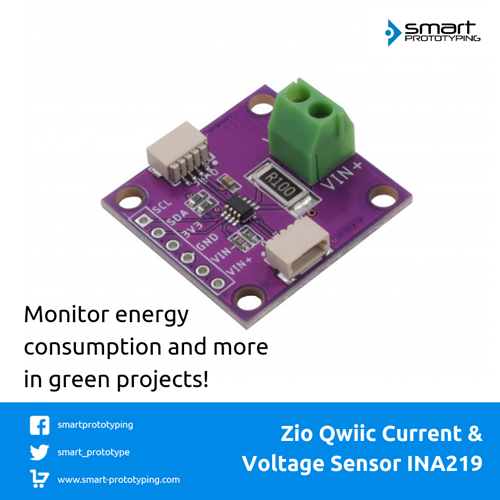

# Zio-Qwiic-Current-Voltage-Sensor-INA219

> This product can be available for purchase [here](https://www.smart-prototyping.com/Zio-Qwiic-Current-Voltage-Sensor-INA219).

#### Description

A current and power monitor on a breakout board! This board right here features an INA219, enabling to read DC current drop and power over I2C with a high precision, up to 1%.

This board can be used for many applications such as estimating battery life, measuring battery levels, tracking solar power generation or monitoring the amount and cost of electricity consumption. 

It can measure voltage up to +26VDC, incorporating a 0.1 ohm shunt resistor for measuring the current (labeled at R100). The INA219 has a very precise rate on measuring voltage draw over the shunt. The current flow is determined along the voltage drop over the shunt, based on Ohm’s law. With the voltage and current known, the power can be also calculated. 

The maximum voltage drop that the INA219 can measure is ±320mV, thence the maximum amperage is 3.2A. The shunt resistor can actually be replaced to have a higher allowance (only for experienced users). 

As the INA219 supports the I2C interface it makes it a lot easier to daisy chain multiple devices and get the data though the Qwiic connector. Pretty cool as we can get the actual numbers for voltage, current and power in its corresponding units. 

To take a measurement on any load, just connect the positive terminal of the power source to VIN+ port. Then connect one of the leads from the load to the VIN- terminal. Connect the other lead to the ground to the power supply negative terminal. Here we go, we have a closed circuit with current flowing to take the measurements.

We also provided the pinout to be able to attach the sensor to a breadboard in case you need it. 

#### Specification

* Operation Voltage: 3.3V
* Bus Voltage: 0- 26V
* Max Current: 3.2A
* Interface: I2C
* IC: INA219
* I2C Address: 0x40, 0x41, 0x44, 0x45, (Default 0x40)
* Dimensions: 25.4 x 25.4mm
* Weight: 3.0g

#### Links

* [Eagle File and Schematic](https://github.com/ZIOCC/Zio-Qwiic-Current-Voltage-Sensor-INA219)
* [Library link](https://github.com/adafruit/Adafruit_INA219)
* [INA219 Datasheet](http://www.ti.com/lit/ds/symlink/ina219.pdf)

> ###### About Zio
> Zio is a new line of open sourced, compact, and grid layout boards, fully integrated for Arduino and Qwiic ecosystem. Designed ideally for wearables, robotics, small-space limitations or other on the go projects. Check out other awesome Zio products [here](https://www.smart-prototyping.com/Zio).

